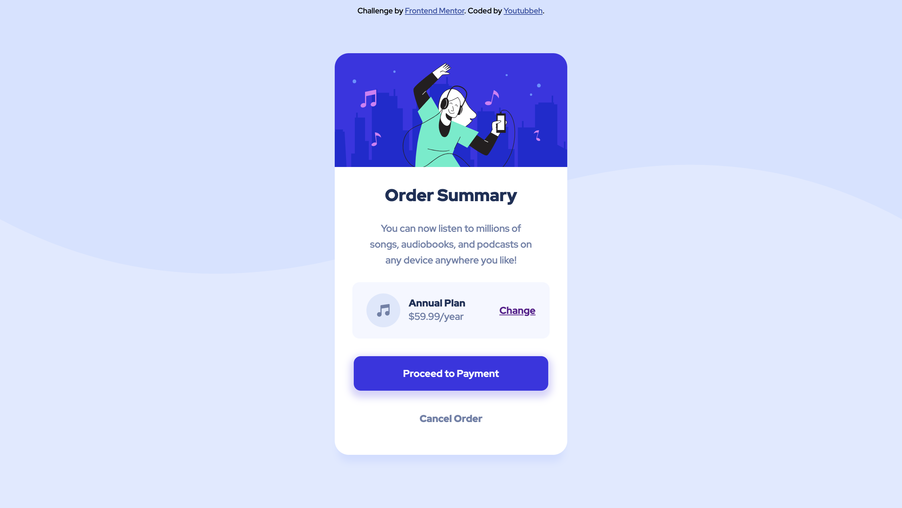

# Frontend Mentor - Order summary card solution

This is a solution to the [Order summary card challenge on Frontend Mentor](https://www.frontendmentor.io/challenges/order-summary-component-QlPmajDUj). Frontend Mentor challenges help you improve your coding skills by building realistic projects. 

<br>

## I would be very thankful if you could point out any errors in my code or ideas on how to make it cleaner or better 😊

<hr>
<br>

### The challenge

Users should be able to: see hover states for interactive elements

### Screenshot



### Links

- Solution URL: [Add solution URL here](https://your-solution-url.com)
- Live Site URL: [Add live site URL here](https://your-live-site-url.com)

## My process

1. Building the structure completely on HTML
2. Connecting Google Fonts
3. Doing everything I (kind of) know how to do on CSS
4. Working on what I don't know how to do by googling for solutions. Check those out below 👇

### Built with

- HTML
- CSS

### What I learned

- Active states in CSS (useful for the button, and also the links):
```css
.button:active {
    background-color: hsl(248, 62%, 62%);
}
 ```

 - Removing underline on a link element through ``text-decoration``:
 ```css
 .inplan a:active {
    color: hsl(248, 62%, 62%);
    text-decoration: none;
 }
```
- Using ``transform: translateY()`` and ``transform: translateX()`` to vertically and horiztontally center an element within their parent element. This was super useful when centering the main box where all the content is, and also when centering the pricing ``div``.
```css
main {
    position: absolute;
    margin: 0 auto;
    width: 330px;
    height: 570px;
    background-color: white;
    border-radius: 20px;
    text-align: center;
    top: 50%;
    left: 50%;
    transform: translateY(-50%) translateX(-50%);
    box-shadow: -0px 15px 10px -5px hsl(226, 100%, 91%);
}
```

Thanks for checking out my little project! As a novice frontend developer, I would greatly appreciate ANY feedback! 🙏

-- Youtubbeh